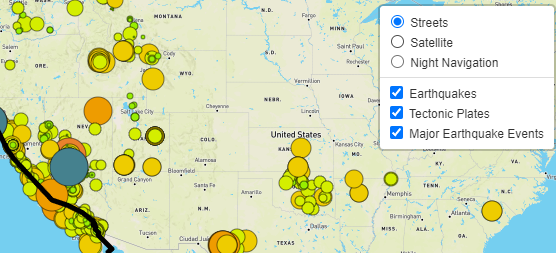
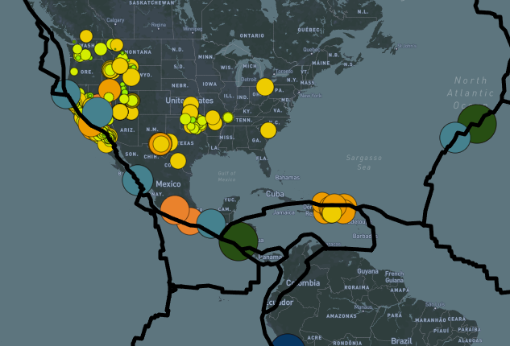
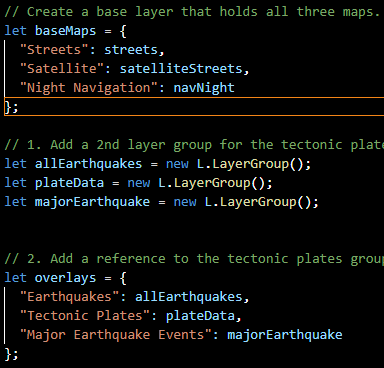

# Mapping Earthquake Events With Javascript and Leaflet

### *Files*:
- HTML Index File: [index](Earthquake_Challenge/index.html)
- Javascript Logic File: [challenge_logic](Earthquake_Challenge/static/js/challenge_logic.js)
- CSS Style File: [style](Earthquake_Challenge/static/css/style.css)
## **Introduction**:
Earthquake events are some of the most common, and most destructive, natural disasters around the world. To assist the Disaster Reporting Network in showing the impact of earthquakes worldwide, all recorded earthquakes that have occurred in the past week have been retrieved and used to create a map that reflects the locations and magnitudes for each earthquake. Using a handful of tools with Javascript and building the visual components with HTML, the Disaster Reporting Network can now display the impact of the most recent earthquakes around the world in a comprehensive and simple map. 

## **Process**:
Creating a visual representation of the earthquake data gathered from the U.S. Geological Survey's website was made possible with the Mapbox API and the Leaflet tool to build multiple levels of useful information over Mapbox's map data. The map contains three layers that the user can select from a menu on the web page, three overlays that provide data represenation over the map's layers, and a legend that references the color coding used for the earthquake markers on the map.

- This visualization began with creating tile layers that used the API's data and provided three different layers to select from a menu on the page created by the HTML file: a simple street view that displays a more minimal amount of information, a satellite view that provides a more detailed satellite image, and a night-time navigation layer that provides a greater level of contrast between the earthquake markers and the map's landscape. The layer select menu is shown in the screenshot below.

- The overlays provided on the map were created to show each earthquake location, provide an option to apply a different color code for the largest magnitude earthquakes for greater contrast, and display the tectonic plates in a thick black line to provide context and allow patterns to be drawn between earthquake frequency and locations nearest to divisions in the tectonic plates. The overlays presented on the map, along with the section of code that creates them, are provided in the screenshots below.

The Map with the Night Navigation Layer Active
- 

The Javascript used to create the overlays
- 

- The final level of detail provided in the Javascript is a legend provided in the bottom-right-hand corner of the page that gives a color code for the basic overlay that presents the earthquakes on a scale based on their magnitude from 0-5+ on the Richter scale. The legend provides a source of visual context for the severity of each earthquake and only the second overlay provides an emphasis on the most extreme-magnitude earthquake events by changing the color codes.

## **Conclusion**:
This project was a great way to showcase the power and applicability of Leaflet and Javascript in data visualization and allowed for very complex data to be presented in a simple and visually appealing way on a web page. The level of detail that can be presented through a relatively small amount of code shows how powerful these tools are and the finished page provides an idea of the wide-reaching possibilities where these tools will come in handy for future projects.
